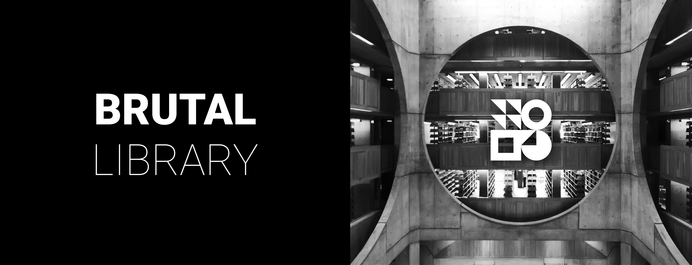

 

  Striking modernist shapes and bold use of modern C are the hallmarks of <b>BRUTAL</b>. 
  Inspired by brutalist design <b>BRUTAL</b> combines the ideals of UNIX from the 1970s  with modern technology and engineering.

 

# BRUTAL - LIBRARY

This repository is automatically updated with the latest version of the brutal library available.

This build of the brutal library is only for x86 posix computer with sdl. But if you want, you can export it to other arch/operating system easily by changing c files in embed.

## Using

If you want to use this library, you should set the include path to libs/ and headers/.

You should use only recent compilers with the latest C standart version.

## Credits

Some part of this library takes inspirations and/or reuse code from the following projects.

See [credits.md](https://github.com/brutal-org/brutal/blob/main/meta/credits.md).

-----

The brutal operating system and its core components are licensed under the **MIT License**.

The full text of the license can be accessed via [this link](https://opensource.org/licenses/MIT) and is also included in the [license](LICENSE) file of the software package.